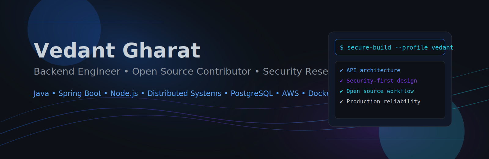
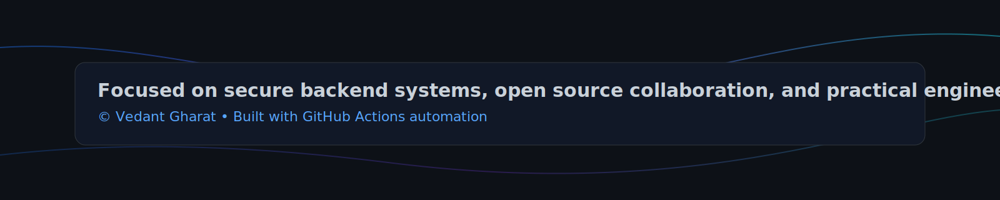

  

# Vedant Gharat

## Backend Engineer • Open Source Contributor • Security Researcher

## About Me

- 🎓 B.Tech Information Technology, **VESIT Mumbai**
- 🧠 Focused on backend architecture, secure APIs, and resilient distributed systems
- 🔐 Interested in practical security research and bug bounty workflows
- 🌍 Building and contributing to open source with production-quality standards

## Current Focus

- Java
- Spring Boot
- Node.js
- Distributed Systems
- PostgreSQL
- AWS
- Docker
- Open Source
- Security Research

## Featured Projects

<table>
  <tr>
    <td width="50%" valign="top">
      <h3>CampusConnect</h3>
      
Smart Campus Management System built with secure authentication and modular backend services.

      

        
        
        
        
        
      

    </td>
    <td width="50%" valign="top">
      <h3>Election Voting System</h3>
      
Secure election platform designed for integrity, transparency, and reliability.

      

        
        
        
        
      

    </td>
  </tr>
  <tr>
    <td width="50%" valign="top">
      <h3>WasteC</h3>
      
Production web application focused on practical usability and dependable backend workflows.

    </td>
    <td width="50%" valign="top">
      <h3>OCR Research</h3>
      
Computer vision and OCR experimentation in Python for document understanding workflows.

      

        
        
      

    </td>
  </tr>
</table>

## Open Source

- ✅ Contributions and issue-driven improvements in **Vercel CLI** ecosystem
- ✅ Active **GitHub Pull Request** participation across collaborative projects
- ✅ Ongoing involvement in **Bug Bounty** and security analysis workflows
- ✅ Continuous **Security Research** with focus on responsible disclosure
- 🧭 Reserved roadmap space for future **GSoC** and **CNCF** contributions

## Tech Stack

<table>
  <tr>
    <th align="left">Category</th>
    <th align="left">Technologies</th>
  </tr>
  <tr>
    <td>Languages</td>
    <td>
      
      
      
      
      
      
    </td>
  </tr>
  <tr>
    <td>Backend</td>
    <td>
      
      
      
    </td>
  </tr>
  <tr>
    <td>Frontend</td>
    <td>
      
      
      
    </td>
  </tr>
  <tr>
    <td>Database</td>
    <td>
      
      
      
    </td>
  </tr>
  <tr>
    <td>Cloud & Infra</td>
    <td>
      
      
      
      
      
    </td>
  </tr>
  <tr>
    <td>Tools</td>
    <td>
      
      
      
      
    </td>
  </tr>
</table>

## GitHub Analytics

  
  

## GitHub Trophies

  

## Contribution Graph

  

## GitHub Streak

  

## Top Languages

  

## Achievements

- Built backend-first solutions across academic and production-focused projects
- Applied secure-by-design patterns in authentication and API development
- Maintained consistent open-source contribution workflow through pull requests
- Combined systems thinking with practical implementation in distributed architecture

## Learning Roadmap

- Advanced system design and observability for distributed services
- Deepening cloud-native backend patterns with AWS and containers
- Security engineering for APIs, platform hardening, and defensive tooling
- Scaling open-source contribution impact in developer tooling ecosystems

## Connect

## Snake Animation

  

## Footer

  
  

    <!--START_LAST_UPDATED-->Last updated: 2026-07-18 UTC<!--END_LAST_UPDATED-->
  

  Designed and crafted with precision for a secure, scalable, and modern engineering profile.

